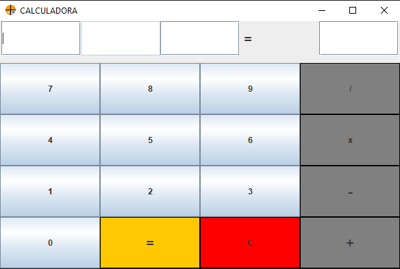

<h1>CALCULADORA COM INTERFACE GRÁFICA</h1>

  Está é uma calculadora normal, porem ainda não é capaz de calcular raiz quadrada e potências. 
    Em atualizações futuras pretendo adicionar mais opções de cálculos para uma calculadora mais  
    completa 

<h2>MODO DE USAR</h2>
<ol>
    <li>Escolha o primeiro número desejado para o cálculo</li>
    <li>Escolha o tipo de cálculo(Soma, Subtração, Multiplicação, Divisão)</li>
    <li>Escolha o segundo número desejado para o cálculo</li>
    <li>Click no botâo de igualdade para ter o resultado</li>
    <li>Click no botão C (botão vermelho) para recomeçar</li>
</ol>

